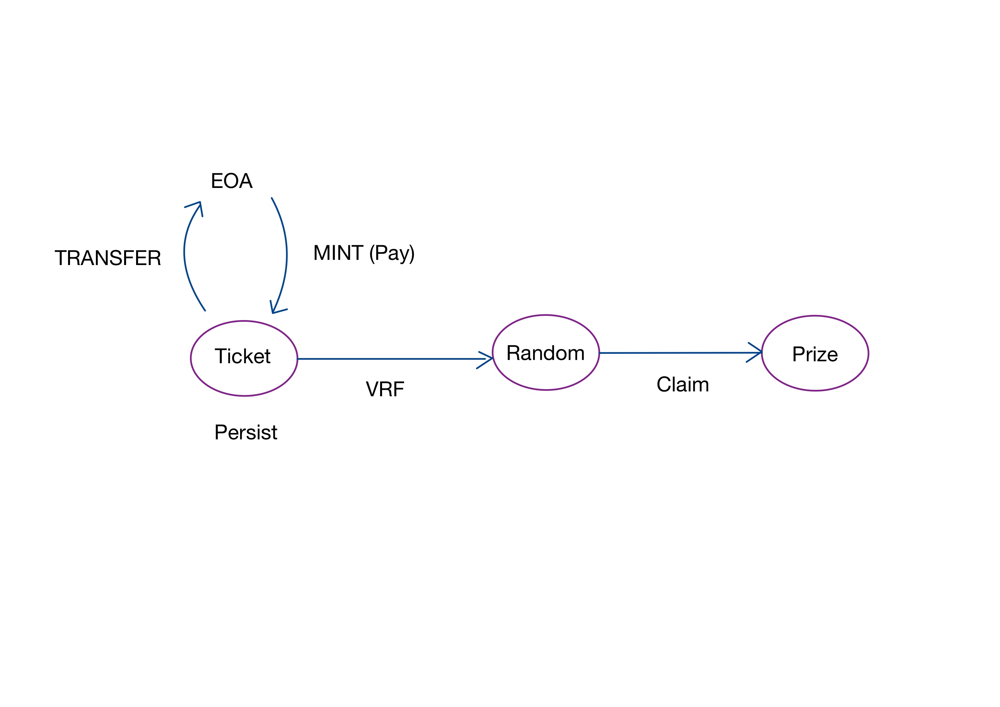

# Task

- [ ] ~~[ERC721](https://docs.openzeppelin.com/contracts/4.x/erc721) or [ERC1155](https://docs.openzeppelin.com/contracts/4.x/erc1155)~~ (Postponded to future versions)

- [ ] Struct for lottery and tickets (onchain data persisting)
  - [ ] Lottery
  - [ ] Tickets

- [ ] Random Function [Link](https://docs.chain.link/vrf/v2-5/overview/subscription)

- [ ] Automation Interval Task: [Link](https://docs.chain.link/chainlink-automation/guides/compatible-contracts)

## Project Plan:

## Materials and Sources

- [OpenZeppelin Contracts](https://docs.openzeppelin.com/contracts/5.x/)

- [Pancakeswap Lottery Contract](https://bscscan.com/address/0x5af6d33de2ccec94efb1bdf8f92bd58085432d2c#code) It gives you some idea about a specific lotto model

- [Ownable](https://docs.openzeppelin.com/contracts/5.x/access-control) This module provides a basic access control mechanism, where there is an account (an owner) that can be granted exclusive access to specific functions.